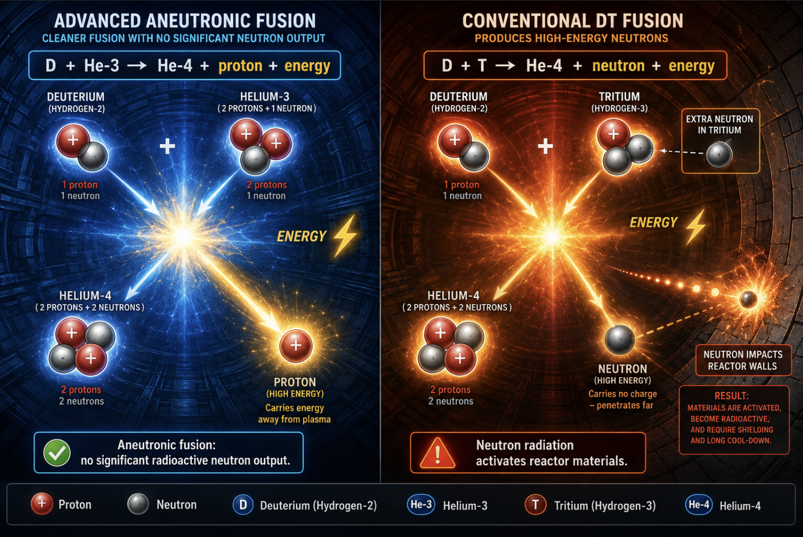
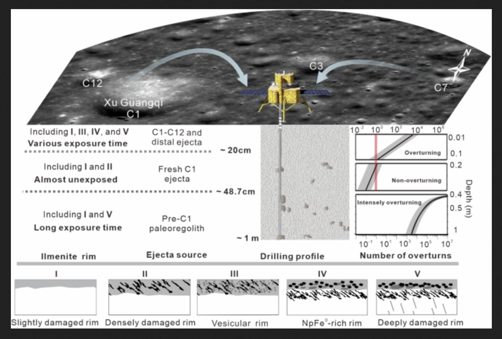

# Lunar Helium-3 Mining & Deuterium-Helium-3 Fusion  
**2026**

## 0. Lunar Pandora
No, not like Pandora's Box... but Greek 'Pandora', and a nod to Final Fantasy VIII.

In Greek mythology, Pandora means "all-gifted" or "all-giving" (from the Greek words pan meaning "all" and doron meaning "gift"). She was the first mortal woman on Earth.

## 1. The Big Picture
Helium-3 (He-3) mined from the Moon + Deuterium from seawater could provide **clean, safe, nearly unlimited fusion power** with **zero radioactive waste**. This is shaping up to be humanity’s next gold rush in space.

## 2. The Science – Why Helium-3 is Special

- Helium-3 is completely stable (no radioactive decay).
- Fusion reaction: **Deuterium + Helium-3 → Helium-4 + Proton + 18.3 MeV energy**
  - Products: Regular helium gas + ordinary hydrogen (protium)
  - **Zero neutrons**, zero radioactive waste, no meltdown risk.

TLDR;

I'll try not to get too technical here, My cousin and her Husband are Nuclear Scientists, I am a Jack of all Trades Scientist including that haha..

so let's recap the periodic table. We only have to do the first TWO (my lucky number) elements. 

Some quick reminders from high school science class ^_~:
- Hydrogen has 1 proton with an electron around it, and Helium has 2 protons with 2 electrons.
  - They can contain 0 or more neutrons in the core.  
- An ISOTOPE is a different neutron configuration.
  - An example: Hydrogen atoms can have 0, 1, or 2 neutrons.

### Hydrogen Isotopes – Kid-Friendly Version:

| Isotope     | Protons | Neutrons | Nickname                  | Source                       | Use / Safety                  |
|-------------|---------|----------|---------------------------|------------------------------|-------------------------------|
| **Protium** | 1       | 0        | Regular Hydrogen          | Water & air                  | Completely safe               |
| **Deuterium** | 1     | 1        | Heavy Hydrogen (D)        | Seawater (unlimited supply)  | Safe, perfect fusion fuel     |
| **Tritium** | 1       | 2        | Radioactive Hydrogen      | Special reactors             | Decays into He-3 (~12 years)  |

Here is just one way to go about harnessing this:

https://thefusionreport.substack.com/p/deep-dive-helions-direct-drive-energy

**How to explain it to a child:**  
We grab heavy hydrogen from the ocean and helium-3 from Moon dust. Smash them together in a super-hot plasma → they become normal helium and normal hydrogen + tons of clean electricity. No radiation!

## 3. Helium-3 on the Moon

- **Confirmed**: Apollo missions + China’s Chang’e-5 & Chang’e-6 samples.
- Concentration: Average ~10 parts per billion (ppb) in regolith.
- **Depth**: Almost all in the **top 2–3 meters** only.  
  **Important:** We do **NOT** have to dig deep — just scrape the surface layer!
  

## 4. Detailed Mining Plans

### Key Challenges & Solutions
- He-3 is trapped in tiny grains of lunar dust.
- When heated, it releases as gas.
- **Big problem**: Moon has no atmosphere — gas escapes into space forever.
- **Solution**: Everything must happen inside **sealed, pressurized enclosures**.

### Mining Approaches We Discussed

| Setup Type              | Size Example          | How It Works                                                                 | He-3 Yield Estimate                  | Notes |
|-------------------------|-----------------------|------------------------------------------------------------------------------|--------------------------------------|-------|
| Small Fixed Base       | 10 acres             | Stationary, scrape top 3m                                                    | ~2 kg total (one-time)              | Good starting point |
| Larger Fixed Base      | 100 acres            | Same as above                                                                | 20–30 kg total                      | Enough for a city for ~1 year |
| **Mobile Mining Fleet** (Recommended) | Rovers covering fresh ground daily | Move constantly, process 500–2,000 tons/day                                 | 5–20 grams per day per miner        | Best long-term plan |
| Industrial Scale       | 70-mile diameter area (1 year) | Large fleet of rovers + central processing plant                             | 3.6 tons per year                   | Powers US + China + Russia + Saudi |

### Dome / Bubble Details
- Use large **pressurized domes or enclosed processing bubbles**.
- Inside the dome: normal air/oxygen mix (for workers) or just processing gas.
- Released He-3 (being the lightest gas) **floats to the top** of the dome.
- Collection pipes at the ceiling suck it out and store it.
- Domes keep everything contained — no loss to space.

### Digging Depth
- **Only 2–3 meters maximum** — highlighted again because it’s a huge advantage.
- Regolith is loose and easy to scoop (no hard bedrock needed).
- Rovers with buckets, scrapers, or conveyor systems handle it easily.

### Rover / Mobile Miner Concept
- Solar-powered or nuclear-powered rovers.
- Continuous operation: scoop → transport → heat in sealed ovens → collect gas → move on.
- One large rover fleet could process 100,000+ tons of regolith per day at full scale.

## 5. How Much Helium-3 Do We Need?

| Goal                                              | He-3 Required          | Mining Scale (3m deep)                     |
|---------------------------------------------------|------------------------|--------------------------------------------|
| One big city (New York) per day                  | 66 grams               | Small mobile fleet                         |
| Entire United States – 1 year                    | ~1 ton                 | ~4 mile diameter circle                    |
| US for 20 years                                  | 20 tons                | ~35 mile diameter over 20 years            |
| US + China (20 years)                            | 40 tons                | ~50 mile diameter                          |
| US + China + Russia (20 years)                   | ~50 tons               | ~55 mile diameter                          |

## 6. Other Ways to Get Helium-3
- Tritium decay (Earth method) – can be done safely in remote deserts, then ship clean He-3 to cities.
- The Moon remains the best long-term source.

## 7. Fun & Important Facts
- Moon drifts away ~3.8 cm/year — mining has zero effect.
- Deuterium from seawater is unlimited.
- One ton of He-3 powers the entire US for one year.
- Truly the **next space gold rush**.

---

**Bottom Line:**  
We only need to dig the shallow top 2–3 meters of lunar soil. With mobile rovers and sealed domes/bubbles, we can collect helium-3 efficiently. Combined with unlimited deuterium from the ocean, this gives us the cleanest energy source imaginable.

---

*Recap generated from conversation with Grok – May 2026*
